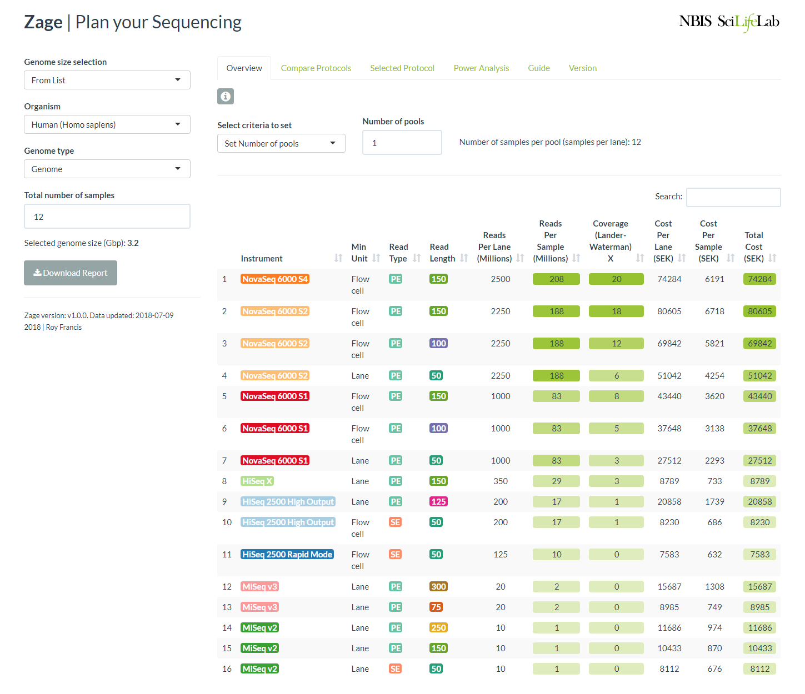

# Zage

Zage is an R Shiny application to help you plan your sequencing experiment. Use this tool to compare sequencing depth, coverage and cost on various sequencers based on the number of samples and pools. Optionally, use the power analysis tool to estimate number of samples required to detect genes for RNA-Seq.



This app is available [online](http://rshiny.nbis.se/zage/).

The app is designed mainly for use by Swedish researchers using SciLifeLab sequencing services. Therefore, the prices are in Swedish Kroner (SEK).

If the app is run locally, the following R packages are required:

```
install.packages(c("Cairo","shiny","plyr","dplyr","formattable","tidyr",
                 "RColorBrewer","shinythemes","highcharter","rmarkdown",
                 "knitr","markdown","DT","ggplot2","shinyBS","RNASeqPower"),
                 dep=TRUE)
```

Then from within R, while standing in the app directory, run:

```
library(shiny)
runApp()
```

<hr>

<b>2018</b> | Roy Francis | [SciLifeLab](https://www.scilifelab.se/) | [NBIS](https://nbis.se/)