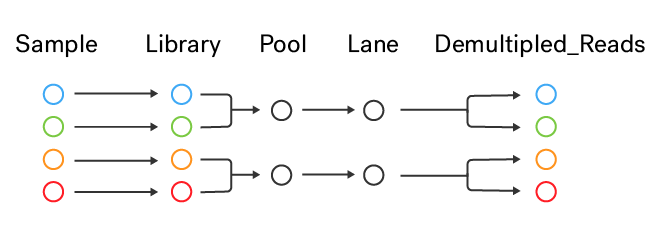

#### [1. Usage](#usage)  
#### [2. Details](#details)   
#### [3. Contact](#contactmarker)  

---

<div class="guide_intro">
Zage helps you plan your NGS sequencing experiment. Use this tool to compare sequencing depth, coverage and cost on various sequencers based on the number of samples and pools. Optionally, use the power analysis tool to estimate number of samples required to detect genes.
</div>

<a name="usage"><h3>1. Usage</h3></a>  

#### 1.1 General

> Once the app is loaded in the browser, the session is ready for use. As long as the user interacts with the app, the session remains active. If the session is inactive for some time, the session is automatically closed down.

> It is best to adjust widgets in the order from top left to bottom right. This is because once changes have been made to widgets further down, changes to top widgets may reset the settings of those below.

#### 1.1 Side Panel

* Select a 'Genome size selection' option

> Pick 'From List' to choose from a pre-defined list of organisms. Else, choose 'Custom' to enter your own organism/size value.

* Select an 'Organism'

> If 'Genome size selection' was set to 'From List', select an organism from the drop-down list. If 'Genome size selection' was set to 'Custom', enter a text label for your organism.

* Enter genome/transcriptome size in Gb

> If 'Genome size selection' was set to 'Custom', enter a number denoting size of the haploid genome or transcriptome in gigabases.

* Select 'Genome type' (Genome/Transcriptome)

> If 'Genome size selection' was set to 'From List', the genome size in Gigabases is automatically set. If 'Genome size selection' was set to 'Custom', this is just a label. The selected genome size will be displayed below.

* Set the total number of samples

> This is the total number of individual samples (libraries) to be sequenced. This is not pools.

#### 1.3 Overview

* Under Overview tab, set the number of pools OR the number of samples per pool. 

> If number of pools are set, samples per pool is computed. And vice-versa. Number of pools and samples per pool must be an exact multiple of the total number of samples. It is assumed that each pool will be run on one lane. If all samples will be pooled together and sequenced on a single lane, set number of pools to 1. If no pooling will be done (each sample goes on its own single lane), set the number of pools equal to the number of samples. Hover over the table header for more information about the column. The table can be sorted by any column by clicking on the header. The search bar can be used to filter the table. 

#### 1.4 Compare Protocols

* Compare Protocols tab

> The combinations of instrument, read type and read length is merged to form a protocol. This tab shows various metrics (cost per sample, total cost, coverage and reads per sample) for all protocols and all poolings (samples per lane) from 1 to total number of samples.

#### 1.5 Selected Protocol

* Under Selected Protocol tab, select the protocol.

> The combinations of instrument, read type and read length is merged to form a protocol. Check 'Show short list' to only show lane configurations that are perfect multiples of total number of input samples (Or in other words, only show lane configurations where all samples are evenly distributed across n lanes). Hover over the table header for more information about the column. The table can be sorted by any column by clicking on the header. The search bar can be used to filter the table.

#### 1.6 Power Analysis

> Power analysis involves six arguments:
>
>  * Sequencing **Depth** (Number of reads mapping to a feature) `5-20`
>  * Biological coefficient of variation (**CV**) within groups between replicates
>  * Relative expression **Effect** to detect (Like Fold Change)
>  * False positive rate (**Alpha**) (Like p-value) `0-1`
>  * **Power** (The fraction of true positives that will be detected) `0-1`
>  * **N** (Number of samples in each group)
>
> Estimate any variable (except depth) while providing input values for the other five variables. Each input field can take minimum one or more values. If more than one value is supplied, it must be delimited by a comma `,`.

* Select a variable to estimate, then fill in appropriate values for input variables.
* Here are some sample questions answered using power analysis:
  
>  * How many samples do I need per group to detect a gene that is differentially expressed at a fold change of 2?
>  * I have 3 samples per group. Do I have the power to detect a gene that is differentially expressed at a fold change of 1.25?  
>  * I have 6 samples per group. What is the effect size that I can expect to find?

<a name="details"><h3>2. Details</h3></a>   

Overview tab uses three input variables (genome/transcriptome size in gb, total number of samples, number of pools) and one computed variable (number of samples per pool) along with the instrument metrics (read type, read length, reads per lane, cost per lane) to compute coverage, cost per sample and total sequencing cost for all samples.

```
samples_per_pool = total_number_of_samples / number_of_pools
reads_per_sample = reads_per_lane / samples_per_pool
coverage_rd = (reads_per_sample * read_length_bp * read_type) / (ome_size_bp)
cost_per_sample = cost_per_lane / samples_per_pool
cost_total = cost_per_sample * total_number_of_samples
```

For example;

```
total_number_of_samples = 12
number_of_pools = 1

samples_per_pool = 12/1 = 12
reads_per_sample = (2500*10^6) / 12 = 208333333
coverage_rd = (208333333 * 150 * 2) / 3.2*10^9 = 62500000000 / 3200000000 = 19.5X
cost_per_sample = 74284 / 12 = 6190.3
cost_total = 6190.3 * 12 = 74284
```

  
*__Fig 1__: Sequencing workflow and terminology.*  

Power analysis is performed using R package [RNASeqPower](https://bioconductor.org/packages/release/bioc/html/RNASeqPower.html). See package description or vignette for more details.

<a name="contactmarker"><h3>3. Contact</h3></a>  
If you have any comments, suggestions or would like to report an issue, please write to `roy.francis@nbis.se`. 
  
[Go to Top](#usage)  
